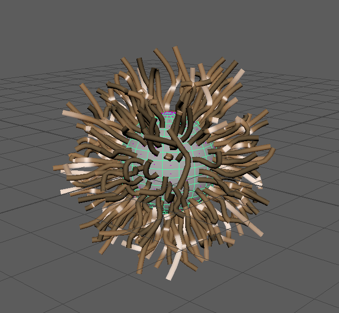
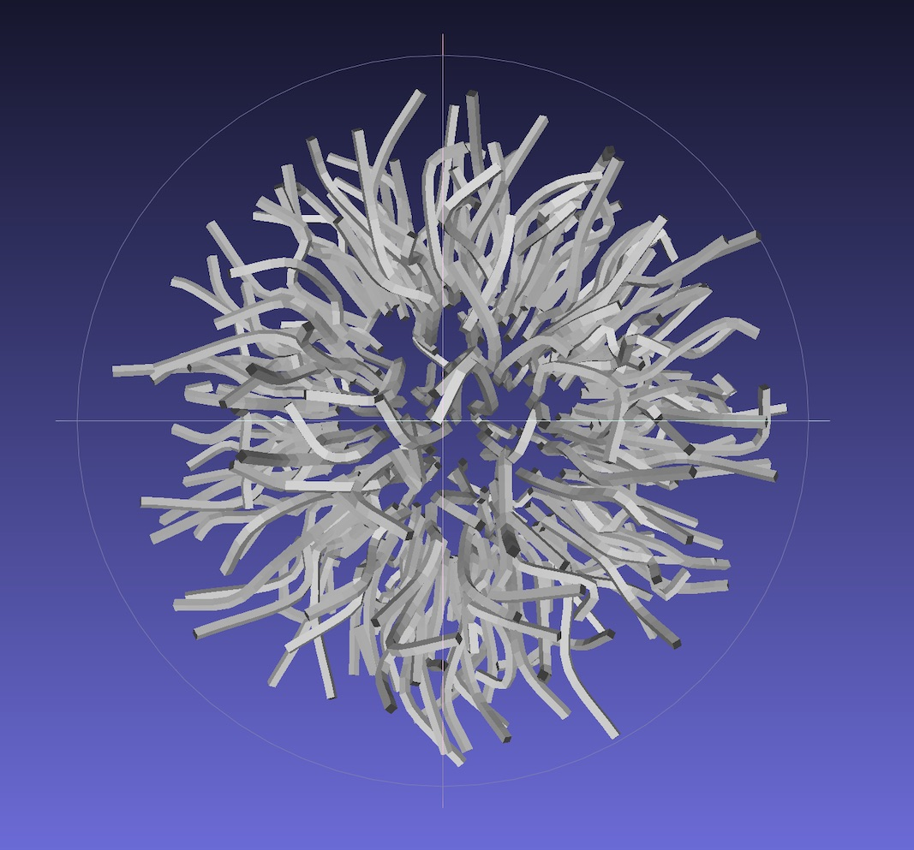

# tubular-cpp, curves primitive to tubular mesh converter in C++




C++ port of unity-tubular https://github.com/mattatz/unity-tubular

Currently .xpd curve data is supported.

Assume Catmull-Rom curves.

## Requirements

* cmake
* C++11 compiler(clang recommended)

## Supported platform

* [x] Linux 64bit
* [x] macOS
* [x] Windows(Visual Studio 2017 or later)
* [ ] Android(will work)

## Supported curve data

* [x] Xgen `.xpd` https://github.com/syoyo/tinyxpd
  * https://knowledge.autodesk.com/support/maya/learn-explore/caas/CloudHelp/cloudhelp/2019/ENU/Maya-CharEffEnvBuild/files/GUID-43899CB9-CE0F-476E-9E94-591AE2F1F807-htm.html
* [x] CyHair http://www.cemyuksel.com/research/hairmodels/
  * [x] Per-CV radius(thickness)
* [ ] Photobooth  https://people.csail.mit.edu/sparis/publi/2008/siggraphHair/#docs
* [ ] Alembic curves?

## Build

### Mac or Linux

```
$ ./bootstrap-clang.sh
$ cd build
$ make
```

### Windows

For command prompt or PowerShell, simply run `vcsetup.bat` (Use VS2017)

For Git for Windows terminal(mintty bash), run

```
$ cmd //c vcsetup.bat
```


## Usage

Convert curves data to wavefront .obj. Setting is done in `config.json` file.

```json
{
    "xpd_filepath": "/path/to/hoge.xpd",
    "cyhair_filepath": "/path/to/cyhair.hair",
    "obj_filepath": "/pat/to/hoge.obj",
    "max_segments": 15,
    "radial_segments": 3,
    "radius_scale": 1.0,
    "user_radius": -1.0
}
```

Input curves can be speficied either `xpd_filepath` or `cyhair_filepath`.

- `xpd_filepath` Input .xpd file (str)
- `cyhair_filepath` Input cyhair .hair file (str)
- `obj_filepath` Outout wavefront .obj (str)
- `max_segments` The maximum number of segments per strand　(int)
- `radial_segments` The number of radial segments (int)
- `radius_scale` radius scale (float)
- `user_radius` Use user supplied radius. If `user_radius` is negative, tubular uses the thicknesses stored in curves data(cyhair only for now). (float)

### How to execute

```
$ ./tubular-cli /path/to/config.json
```

## TODO

* [ ] Interactive GUI
* [ ] Support more curves format
  * [x] Cyhair
  * [ ] Alembic
  * [ ] RenderMan RiCurves?

## License

tubular-cpp is licensed under MIT license.

### Third party licenses

- [unity-tubular](https://github.com/mattatz/unity-tubular) MIT License
- [StaticJSON](https://github.com/netheril96/StaticJSON) MIT License
- [RapidJSON](https://github.com/Tencent/rapidjson) The 3-Clause BSD License
- [TinyXPD](https://github.com/syoyo/tinyxpd) MIT License
- [tinyobjloader](https://github.com/tinyobjloader/tinyobjloader) MIT License
- [spdlog](https://github.com/gabime/spdlog) MIT License
